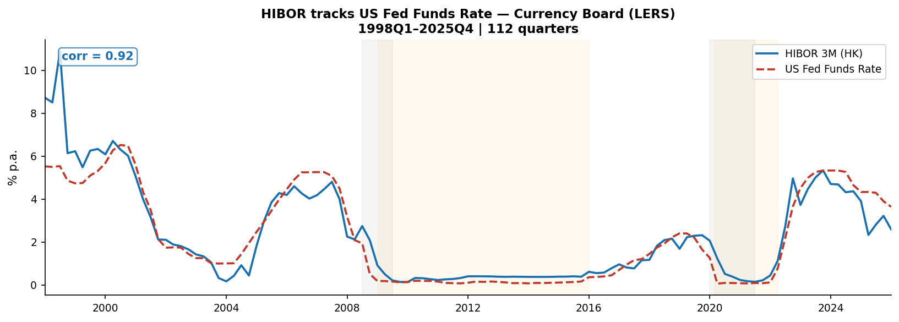
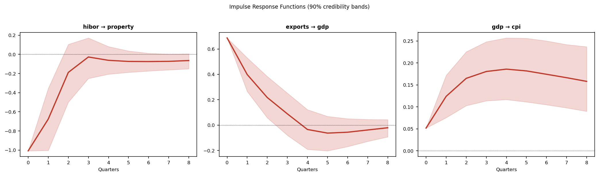
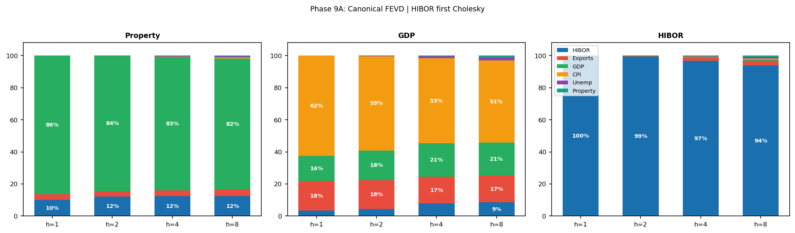
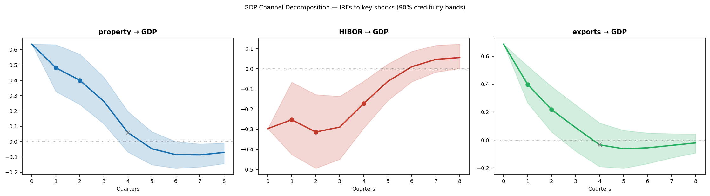
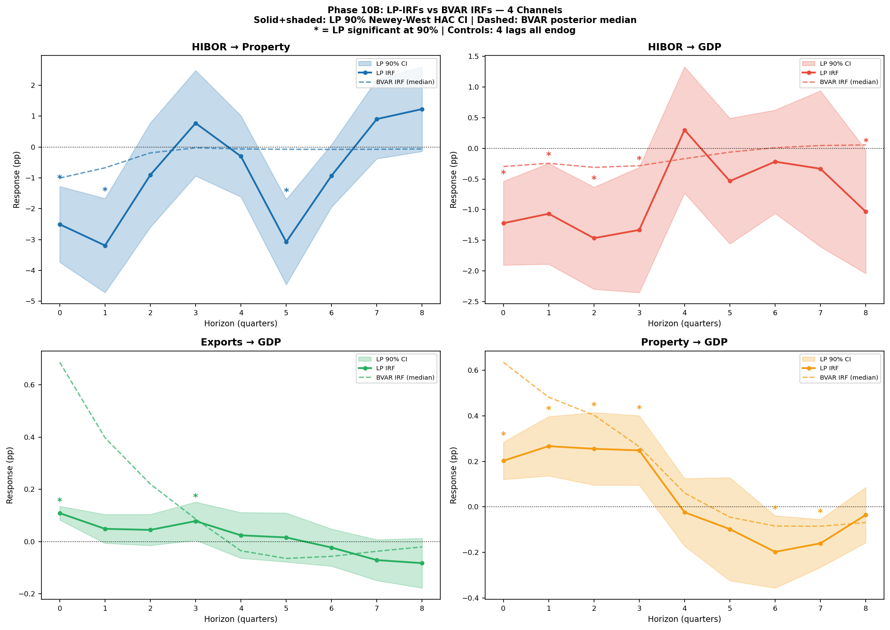
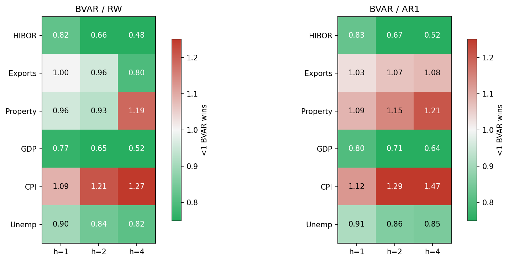

# Hong Kong External Shock Transmission under LERS

> 1998Q1-2026Q1 | 113 quarters | BVAR(4), Minnesota prior | HIBOR-first Cholesky ordering

## Figures













OOS diagnostic is conditional on realized future `us_ffr` and `china_gdp`.

---

## Main Results

| Channel | Main estimate | Timing | Read |
|---|---:|---|---|
| Property -> GDP | 20.7% of GDP FEVD | h=1-2 | largest GDP variance channel |
| Exports -> GDP | 16.4% of GDP FEVD | h=1-2 | China demand channel |
| HIBOR -> GDP | 8.4% of GDP FEVD | h=1-4 | slower direct monetary channel |
| HIBOR -> property | 12.3% of property FEVD | h=1 | fast rate-to-property pass-through |

Timing = BVAR horizons where 90% posterior bands exclude zero.

---

## Exogenous Dynamic Multipliers

- 1pp shock → HK GDP (pp response). 
- From `exo_irf_can` rather than Cholesky FEVD.
- US FFR → GDP: h=1 is positive due to US demand channel; turns negative h=4 as monetary tightening dominates

| Shock | h=1 | h=2 | h=4 |
|---|---:|---:|---:|
| US FFR → GDP | +0.224 | −0.024 | −0.196 |
| China GDP → GDP | +0.219 | +0.131 | −0.004 |

---

## Robustness

| Check | Result |
|---|---|
| Welch t & Levene | GDP stable across GFC/COVID; CPI has COVID mean break (p=0.034) |
| LP-IRF | HIBOR-property, HIBOR-GDP, and property-GDP supported; exports-GDP weaker |
| Delta-u | Headline channels unchanged |
| Exogenous lag | `us_ffr_lag1` does not remove GDP/CPI LB failures; keep q=0 |
| Johansen | Rank 0 on endogenous I(1) block (cpi, unemployment, property level); VECM not used |
| Stationarity | exports, gdp, property QoQ: I(0); cpi, unemployment, property level: I(1); hibor: ambiguous (ADF p=0.037, KPSS p=0.050, enters levels on economic grounds) |

---

## Model

| Item | Choice |
|---|---|
| Sample | 1998Q1-2026Q1, 113 quarters |
| Model | BVARX(4), Minnesota prior |
| Exogenous | `us_ffr`, `china_gdp` |
| Ordering | HIBOR → exports → property → GDP → CPI → unemployment |

---

## Files

| File | Role |
|---|---|
| `HK_BVAR_Final.ipynb` | Canonical result notebook |
| `HK_BVAR_Exploration.ipynb` | Baseline development and supplementary checks |
| `fetch_real_data.py` | Rebuild data from APIs |
| `data_source.md` | Data sources and stationarity audit |

---

## Refresh Data

```bash
python fetch_real_data.py
```
