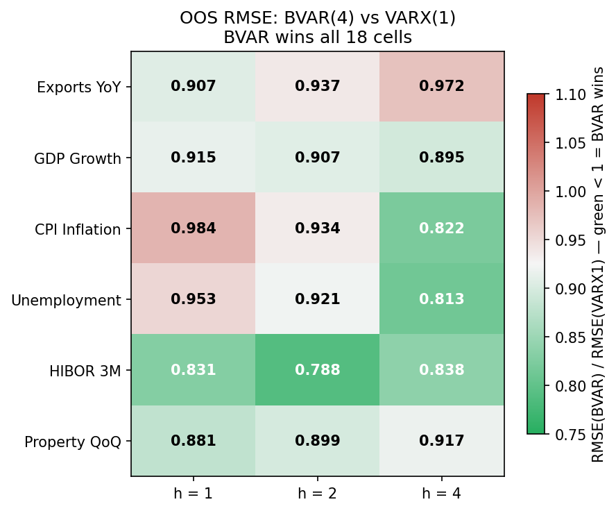

# HK Monetary Transmission — BVAR(4) Evidence

> How do US monetary policy and China growth shocks transmit to Hong Kong GDP under the currency board?
> **1998Q1–2026Q1 | 113 quarters | BVAR(4) Minnesota prior | Cholesky identification**


---

## Transmission Channels

```
US FFR ──→ HIBOR ──┬──→ PROPERTY ──→ ┐
                   │                  ├──→ GDP
                   └──────────────────┘  (direct credit/mortgage)

CHINA GDP ──→ EXPORTS ──────────────────→ GDP
```

---

## GDP Variance Decomposition (FEVD, h=8)

```
property → GDP  ████████████████████░░░░░░░░░░  20.6%  ← dominant driver
exports  → GDP  ████████████████░░░░░░░░░░░░░░  16.5%
hibor    → GDP  ████████░░░░░░░░░░░░░░░░░░░░░░   8.6%
```

---

## IRF Significance Map (90% credibility bands)

```
              h=1    h=2    h=4
hibor → prop   ●      ○      ○     fast, fades after h=1
hibor → gdp    ●      ●      ●     persistent through h=4
prop  → gdp    ●      ●      ○     amplifies h=1–2
exp   → gdp    ●      ●      ○     robust at h=1–2

●  significant (CI excludes zero)
○  CI crosses zero
```

---

## Speed Asymmetry Within Channel 1

```
         h=1    h=2    h=4    h=8
prop     [●]    [○]    [○]    [○]   hits hard, fades
credit   [●]    [●]    [●]    [○]   sustained via mortgage/investment
```

Property is the primary GDP variance amplifier (20.6% FEVD).  
Direct credit channel outlasts it — that's the persistence.

---

## ZLB Asymmetry (HIBOR → Property)

```
Normal rate environment  (FFR ≥ 0.25%)   β = −2.68  ✓  significant
ZIRP                     (FFR < 0.25%)   β = −0.60  ✗  CI spans zero

2009Q1–2022Q1: 36/113 obs at zero bound
```

Monetary transmission impaired when rates are pinned at floor.

---

## Model

BVAR(4), Minnesota prior, ML-optimised hyperparameters. Cholesky ordering: hibor → exports → property → gdp → cpi → unemployment. Exogenous: us\_ffr, china\_gdp (contemporaneous). OOS RMSE: BVAR wins 18/18 cells vs VARX(1). Full specification in `paper/main.tex` §3.



---

## Robustness

```
Structural stability   Chow GDP 2008 p=0.15 ✓   GDP 2020 p=0.26 ✓
                       CPI COVID mean break p=0.03  (acknowledged)
                       Bai-Perron: 0 breaks in all variables ✓

LP-IRF (Jordà 2005)    3 channels strong, exports→GDP borderline, HAC SEs ✓
Δu robustness          headline IRFs unchanged with Δunemployment ✓
FFR lag sensitivity    VARX(4,1) LB unchanged, keep q=0 ✓
Johansen rank=0        VECM not warranted ✓
```

---

## Files

| File | Role |
|---|---|
| `HK_BVAR_Final.ipynb` | Canonical — all results, 6 sections |
| `HK_BVAR_Supplementary_Analysis.ipynb` | Baseline development and supplementary checks |
| `fetch_real_data.py` | Rebuild data from APIs |
| `paper/main.tex` | Paper draft |
| `data_source.md` | Variable definitions and stationarity results |

---

## Refresh Data

```bash
python fetch_real_data.py
# → data/hk_macro_varx_ready.csv
```
